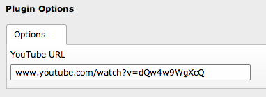

.. ==================================================
.. FOR YOUR INFORMATION
.. --------------------------------------------------
.. -*- coding: utf-8 -*- with BOM.

.. include:: ../Includes.txt

What does it do?
================

Born out of a little frustration with the default TYPO3 Media Content Element, this extension makes embedding a YouTube video into your TYPO3 CMS website a piece of cake. Problems with the default Media Element: it uses the old YouTube embed code (so the video isn't available on non-Flash devices), it's difficult for editors to configure and the plugin options are weird.

With Fluid Content YouTube, embedding a YouTube video is as easy as pasting the YouTube video URL into the desired field. By default, it uses the new (iframe-based) YouTube embed code, for all your video watching pleasures on non-Flash devices. And since responsive design is here to stay, Fluid Content YouTube makes the embed responsive with few lines of CSS.

Or, if you need some bullet points to convince your boss:

* Use the *new* YouTube embed code (``iframe``-based), so the video is available on non-Flash devices (e.g. iPhone, iPad)
* Just copy-paste the YouTube URL, the extension will figure out the right embed code
* Flexible, responsive embedding of the video into the page

So, it basically turns this:

	Fluid Content YouTube Element with an URL to one of the most viewed YouTube videos

into this:

	One of the most viewed YouTube videos shown on an iPhone and MacBook Pro