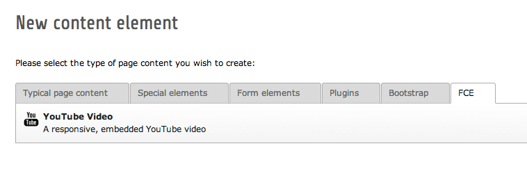
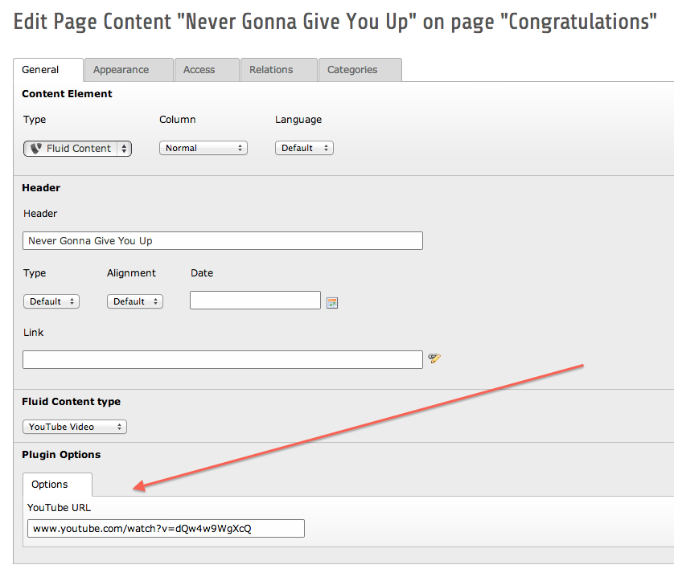

.. ==================================================
.. FOR YOUR INFORMATION
.. --------------------------------------------------
.. -*- coding: utf-8 -*- with BOM.

.. include:: ../Includes.txt

.. _user-manual:

User manual
===========

Adding a new YouTube Video to the page
--------------------------------------

In the New Content Element Wizard a new tab :guilabel:`FCE` (Flexible Content Element) is shown. On this tab, you'll find the YouTube Video element:

	The New Content Element Wizard with the YouTube Video element

Click the YouTube Video element to insert a new YouTube video element on the page. The Edit Page Content screen is shown, where you can enter all necessary details for the content element. The important part is the :guilabel:`YouTube URL` field. Here you can enter the YouTube URL.

	The YouTube URL field of a YouTube Video element on the Edit Page Content screen

Supported YouTube URL formats
-----------------------------

It doesn't really matter which of the many YouTube URLs you enter, the Fluid Content YouTube extension will figure out the right embed code. Currently, the following URL formats are supported:

* ``youtube.com/v/dQw4w9WgXcQ``
* ``youtube.com/vi/dQw4w9WgXcQ``
* ``youtube.com/embed/dQw4w9WgXcQ``
* ``youtube.com/e/dQw4w9WgXcQ``
* ``youtu.be/dQw4w9WgXcQ``
* ``youtube.com/?v=dQw4w9WgXcQ``
* ``youtube.com/?vi=dQw4w9WgXcQ``
* ``youtube.com/watch?v=dQw4w9WgXcQ``
* ``youtube.com/watch?vi=dQw4w9WgXcQ``
* ``youtube.com/watch?feature=player_embedded&v=dQw4w9WgXcQ``
* ``youtube.com/?feature=player_embedded&v=dQw4w9WgXcQ``
* ``youtube.com/user/username#p/u/11/dQw4w9WgXcQ``

All URL formats are supported both with and without ``http://`` and ``https://``.